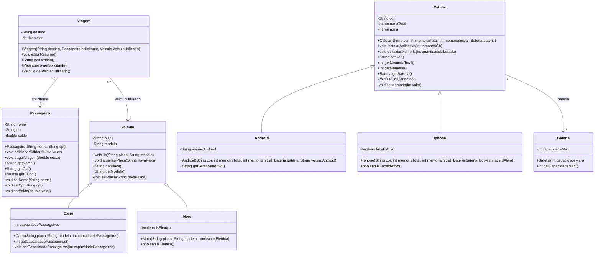

# UML do FiapRide

O diagrama inclui as associações da Aula 5 e as generalizações da Aula 6.
`Carro` e `Moto` herdam de `Veiculo`; `Android` e `Iphone` herdam de
`Celular`. As classes filhas listam apenas seus atributos próprios, pois os
atributos herdados permanecem definidos nas superclasses.

As linhas de associação representam as referências privadas mantidas pelos
objetos. Os papéis `solicitante`, `veiculoUtilizado` e `bateria` aparecem nas
relações sem duplicar os campos na lista de atributos UML. `getDestino()`
retorna `String`, como esperado de um getter para o destino.

O diagrama também está disponível em PlantUML em
[`fiapride.puml`](fiapride.puml).
