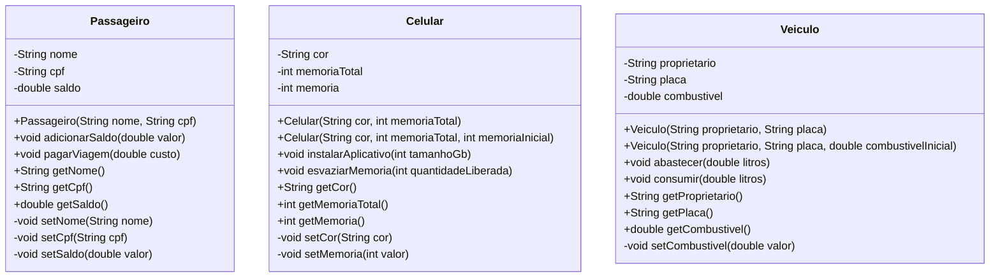

# UML do FiapRide

Os métodos de negócio aparecem na terceira divisão de cada classe e alteram o estado somente após validar as regras correspondentes. Os getters são públicos para leitura controlada, enquanto os setters são privados para impedir alterações diretas externas. `memoriaTotal`, `proprietario` e `placa` não possuem setters porque não devem mudar depois da construção.
