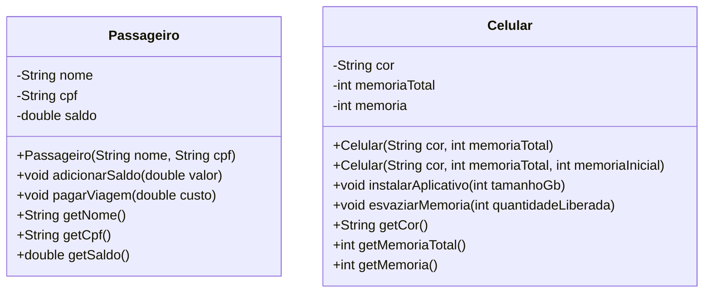

# UML do FiapRide

```mermaid
classDiagram
    class Passageiro {
        -String nome
        -String cpf
        -double saldo
        +Passageiro(String nome, String cpf)
        +void adicionarSaldo(double valor)
        +void pagarViagem(double custo)
        +String getNome()
        +String getCpf()
        +double getSaldo()
    }

    class Celular {
        -String cor
        -int memoriaTotal
        -int memoria
        +Celular(String cor, int memoriaTotal)
        +Celular(String cor, int memoriaTotal, int memoriaInicial)
        +void instalarAplicativo(int tamanhoGb)
        +void esvaziarMemoria(int quantidadeLiberada)
        +String getCor()
        +int getMemoriaTotal()
        +int getMemoria()
    }
```

Os métodos de negócio aparecem na terceira divisão de cada classe e são responsáveis por alterar o estado somente após validar as regras correspondentes.
