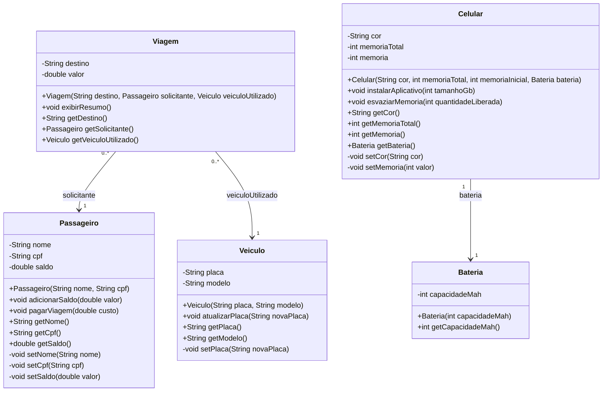

# UML do FiapRide

O diagrama abaixo registra os relacionamentos pedidos na Aula 5. Cada `Viagem`
tem um `Passageiro` solicitante e um `Veiculo` utilizado; os papéis aparecem
com os nomes `solicitante` e `veiculoUtilizado`. O projeto pessoal também tem
uma associação de `Celular` para `Bateria`, chamada `bateria`.

As linhas de associação representam as referências privadas mantidas pelos
objetos. Por isso, `solicitante`, `veiculoUtilizado` e `bateria` aparecem como
papéis das relações, sem repetir esses campos na lista de atributos UML.
`getDestino()` retorna `String`, como esperado de um getter para o destino.

O diagrama também está disponível em PlantUML em
[`fiapride.puml`](fiapride.puml).
