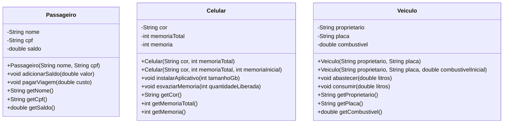

# UML do FiapRide

Os métodos de negócio aparecem na terceira divisão de cada classe e são responsáveis por alterar o estado somente após validar as regras correspondentes. Em `Veiculo`, os atributos são privados e não existem setters públicos: as alterações passam por `abastecer` e `consumir`, que impedem valores inválidos e combustível negativo.
